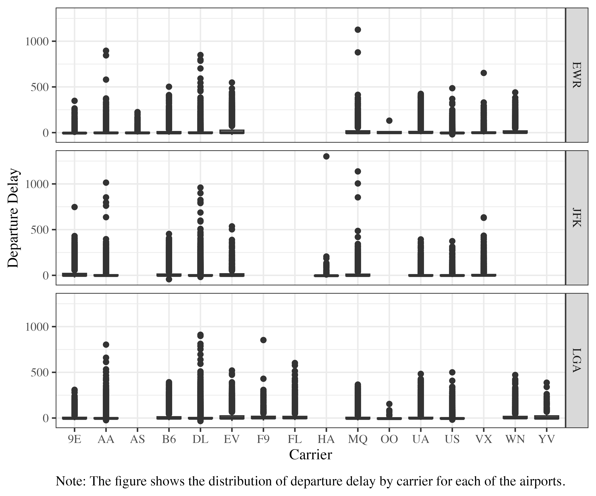

```{r}
#| label: setup
#| include: FALSE

# --- load packages --- #
pacman::p_load(flextable, officer, modelsummary, data.table, dplyr, ggplot2)

# --- set the default font for flextable --- #
set_flextable_defaults(
  font.family = "Times New Roman"
)


# --- prepare results --- #
# You can directly load the R objects created in a different qmd file using the following code. Then, you can use the loaded objects (data, figure, table, etc.) in the current qmd file.
# knitr::knit_child("../code/2_make_tables_figures.qmd", quiet = TRUE)
```


# Introduction

Nothing is more frustrating than flight delays. The goal of this article is to understand what weather variables affect flights delays so that we can control weather when such time comes in the future[^1].

[^1]: This is just for illustrating how to create a footnote

# Method

Regression analysis was used in this article. The econometric model writes as follows ( @eq-econometric-model):

$$
y_{i,t} = \beta_0 + \beta_1 temp_{i,t} + \beta_2 precip_{i,t} + \beta_3 wind_speed_{i,t} + v_{i,t}
$$ {#eq-econometric-model}


## Code availability

All computations (including creating tables and plots) were conducted using R software [@R], The @fixest package was used to run regressions.

# Data

We use publicly available datasets from the R `nycflights13` package [@nycflights13]. @tbl-sum-stat presents the summary statistics.



```{r}
#| label: tbl-sum-stat
#| tbl-cap: Summary Statistics

reg_data <- readRDS("../data/processed/reg_data.rds")

datasummary(
  dep_delay + temp + precip + wind_speed ~ Mean + SD + Max, 
  data = reg_data, 
  output = "flextable"
  ) %>%
  autofit() %>%
  set_caption("Summary Statistics")

```

<br>

@fig-hist-delay shows the histogram of departure delay by carrier for each of the airports.

<br>

```{r}
#| label: fig-hist-delay
#| fig-cap: Distribution of delay by carrier


```

# Results and Discussions

@tbl-reg-results presents the regression results.

```{r}
#| label: tbl-reg-results
#| tbl-cap: Regression Results

ls_reg_results <- readRDS("../results/reg_results.rds")

reg_table <-
  modelsummary(
    models = ls_reg_results,
    coef_map = c(
      "temp" = "Temperature",
      "precip" = "Precipitation",
      "wind_speed" = "Wind Speed"
    ),
    stars = TRUE,
    output = "flextable",
    gof_omit = "IC|Log|Adj|F|Pseudo|Within|RMSE"
  ) %>%
  autofit()

reg_table
```

# Conclusion

Weather matters.




# References {.unnumbered}

::: {#refs}
:::
